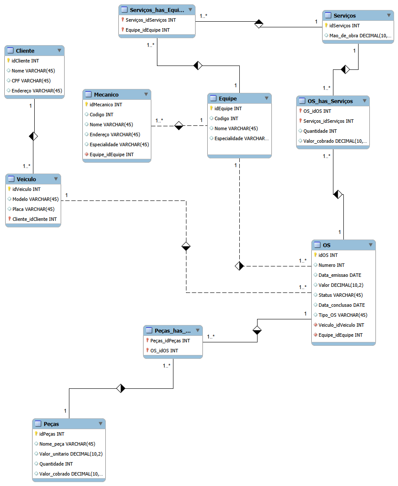

# Modelagem Oficina

Este repositório contém a modelagem lógica e o script de criação do banco de dados para uma oficina de reparos e manutenção.

## 📌 Funcionalidades Modeladas

- Cadastro unificado de clientes e entrada de veiculos.
- Cadastro de mecanico (id, nome, endereço, especialidade), e suas respectivas equipes.
- Veiculos cadastrados em OS, onde direciona pra Equipe.
- Equipe faz avaliaçao de peças e mão de obra necessaria.
- Tabela de valores de mão de obra e de peças.

## 🗺️ Diagrama EER

## 🚀 Como Executar
O script para criação de todas as tabelas está disponível no arquivo script_banco.sql.
